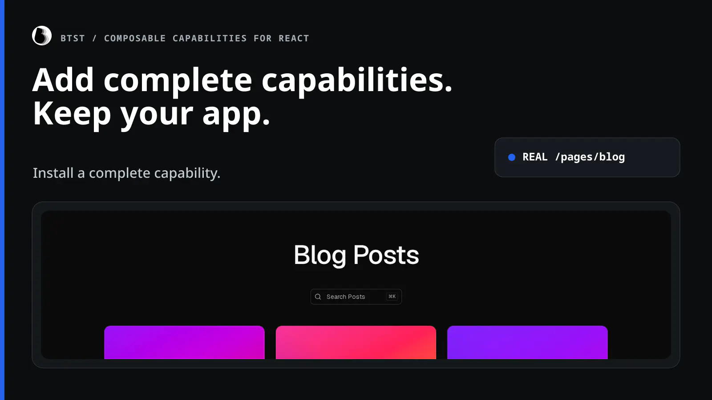
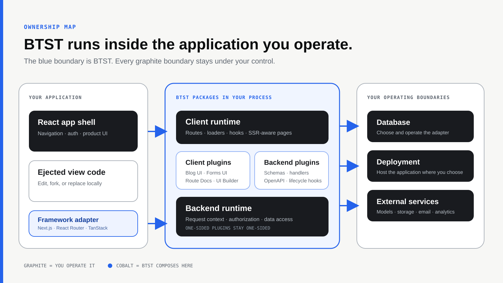
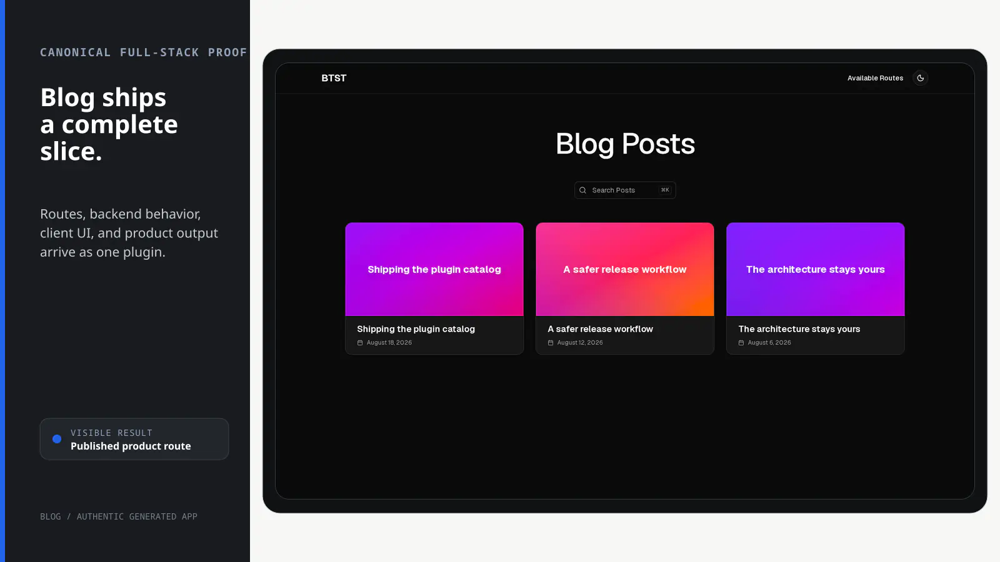
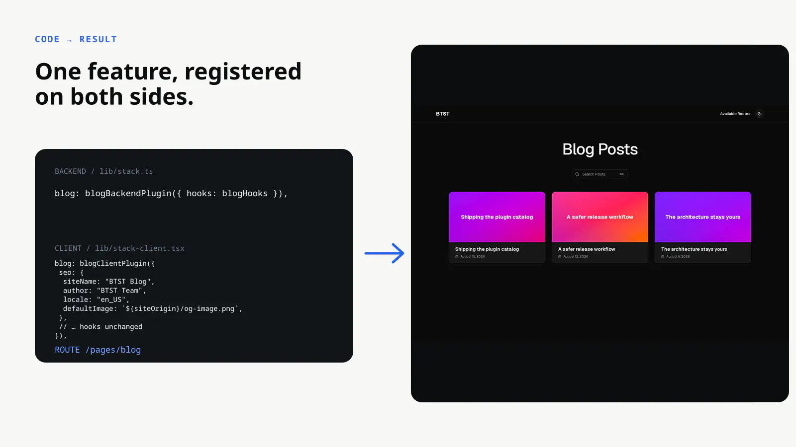

# BTST

<div align="center">

## Add complete features to the React app you already own.

BTST is an open-source TypeScript system for installing full-stack features into existing React applications.

It is built for React/TypeScript developers and small product teams adding a substantial feature to an app they already have. A full-stack plugin can bring the routes, APIs, database schema, hooks, SSR-aware pages, and customizable UI that its feature needs.

**You own the whole application.** Your app, data, deployment, and ejected UI stay yours. BTST runs inside your stack as an open-source dependency you can inspect, fork, or replace—never as a required hosted control plane.

[**Quickstart with Blog**](#quickstart-blog-in-an-existing-nextjs-app) · [View the live Blog](https://www.better-stack.ai/p/blog) · [Read the docs](https://www.better-stack.ai/docs)

[](https://www.npmjs.com/package/@btst/stack)
[](./LICENSE.md)



<sub>Real output from the repository's generated Next.js application.</sub>

</div>

## Where BTST fits

BTST is **more complete than a UI kit, more incremental than a starter application, and more ownable than a hosted feature service**.

| Starting point | What it gives you | Adoption boundary |
| --- | --- | --- |
| UI kit | Components and interaction primitives | Your team still builds the feature's routes, data model, APIs, and workflows |
| Starter application | An application foundation with initial features | You adopt its application structure as the place you start |
| Hosted feature service | A feature operated behind a vendor service boundary | Its control plane, runtime, or data path remains outside your application |
| **BTST** | An installable feature runtime, generated integration, and customizable views | Add one capability inside the app, database, and deployment you already operate |

Start with one plugin and add more only when they are useful. BTST does not replace your application foundation or require a hosted control plane.



<p align="center"><sub>BTST composes client and backend plugins inside the application; the app shell, ejected views, database, deployment, and external services remain yours.</sub></p>

## Quickstart: Blog in an existing Next.js app

This local evaluation uses the public stable releases with Node.js 22, an existing Next.js 15+ App Router application, and Radix-based shadcn/ui with CSS variables. If shadcn/ui is not configured yet, initialize that verified base and add the components Blog needs:

```bash
pnpm dlx shadcn@4.19.1 init --base radix --preset nova --css-variables
pnpm dlx shadcn@4.19.1 add button dropdown-menu sonner --yes
```

Render the generated `<Toaster />` in your root layout and start from a clean commit you can review. The [complete prerequisite checklist](https://www.better-stack.ai/docs/installation#quickstart-prerequisites) covers the remaining application requirements.

Run the released generator from the application root:

```bash
pnpm dlx @btst/codegen@0.2.0 init \
  --framework nextjs \
  --adapter memory \
  --plugins blog
```

The generator shows detected-file and conflict prompts before it writes. It installs `@btst/stack@3.0.0`, registers Blog on the backend and client, mounts the API and page routes, adds the plugin CSS, and wires the shared provider.

Set the trusted local origins in `.env.local`:

```dotenv
BTST_SITE_URL=http://localhost:3000
BTST_API_URL=http://localhost:3000
```

Then start the app and open the generated route:

```bash
pnpm dev
# http://localhost:3000/pages/blog
```

`/pages/blog` is the success condition. A fresh local route can be empty until you create content. The memory adapter resets with the process and is for evaluation and tests, not production persistence; Blog image uploads also remain an explicit application override. Continue with the [production and manual setup reference](https://www.better-stack.ai/docs/installation) before deploying.



<p align="center"><sub>The same generated Blog route after deterministic sample content is added.</sub></p>

### The registration that produces the route

The stable-v3 seam is deliberately small: the backend plugin supplies Blog's server behavior and data model; the client plugin supplies its routes and UI. The generator provides the surrounding adapter, API/site runtime, QueryClient, catch-all routes, and provider wiring.

```ts
import { createBackendStack } from "@btst/stack/api"
import { createMemoryAdapter } from "@btst/adapter-memory"
import { blogBackendPlugin } from "@btst/stack/plugins/blog/api"

createBackendStack({
  basePath: "/api/data",
  adapter: (db) => createMemoryAdapter(db)({}),
  plugins: { blog: blogBackendPlugin() },
})
```

```tsx
import { createClientStack } from "@btst/stack/client"
import { blogClientPlugin } from "@btst/stack/plugins/blog/client"
import type { QueryClient } from "@tanstack/react-query"

function createAppClientStack(queryClient: QueryClient, origin: string) {
  return createClientStack({
    api: { baseURL: origin, basePath: "/api/data" },
    site: { baseURL: origin, basePath: "/pages" },
    queryClient,
    plugins: { blog: blogClientPlugin() },
  })
}
```



Blog adds publishing routes, API operations, its data model, hooks, SSR-aware pages, editor UI, SEO metadata, RSS, and sitemap entries. Other plugins have different boundaries: one-sided and companion plugins are labeled instead of being forced into a full-stack claim.

## Released capabilities

Every capability below is installable from the released CLI. Follow its documentation for the actual payload, services, storage, auth, and adapter prerequisites.

| Capability | Topology | Outcome |
| --- | --- | --- |
| [Blog](https://www.better-stack.ai/docs/plugins/blog) | Full-stack | Publishing workflow, routes, API, data model, editor, SEO, and RSS |
| [AI Chat](https://www.better-stack.ai/docs/plugins/ai-chat) | Full-stack | Streaming conversations, model integration, history, routes, and chat UI |
| [CMS](https://www.better-stack.ai/docs/plugins/cms) | Full-stack | Typed content models, APIs, generated forms, and editorial UI |
| [Form Builder](https://www.better-stack.ai/docs/plugins/form-builder) | Full-stack | Form authoring, validation, rendering, and submissions |
| [Kanban](https://www.better-stack.ai/docs/plugins/kanban) | Full-stack | Boards, columns, tasks, assignment, and drag-and-drop UI |
| [Comments](https://www.better-stack.ai/docs/plugins/comments) | Full-stack | Threads, replies, reactions, moderation, and embeddable UI |
| [Media](https://www.better-stack.ai/docs/plugins/media) | Full-stack | Media storage, library routes, uploads, folders, and picker UI |
| [UI Builder](https://www.better-stack.ai/docs/plugins/ui-builder) | Client-only · requires CMS | Visual page authoring and public rendering over CMS content |
| [OpenAPI](https://www.better-stack.ai/docs/plugins/open-api) | Backend-only | Generated OpenAPI document and interactive API reference endpoint |
| [Route Docs](https://www.better-stack.ai/docs/plugins/route-docs) | Client-only | Generated route reference and navigation UI |
| [Better Auth UI](https://www.better-stack.ai/docs/plugins/better-auth-ui) | Companion · requires Better Auth | Auth and account pages for an existing Better Auth backend |

[Explore the released catalog](https://www.better-stack.ai/docs/plugins) or compare complete generated setups in the [interactive playground](https://www.better-stack.ai/playground?plugins=blog,ai-chat,comments&framework=nextjs&view=preview).

## Compatibility and prerequisites

The maintained and tested v3 integration paths are:

| Framework | Maintained integration |
| --- | --- |
| Next.js 15+ App Router | Route handlers, request-aware and static pages, metadata, and sitemap factories |
| React Router v7 | Framework routes, SSR loaders, navigation, metadata, and sitemap response helpers |
| TanStack Start | File routes, SSR loaders, navigation, metadata, and sitemap response helpers |

Other React integrations may be possible through custom adapters, but they are not part of that maintained matrix.

Versioned adapters are published for Prisma, Drizzle, Kysely, and MongoDB. Support is not blanket-equivalent: plugins that need isolated transactions have stricter persistent-adapter requirements, and the generated Form Builder and Media configurations reject MongoDB. The memory adapter is local and single-process only. Check [compatibility and prerequisites](https://www.better-stack.ai/docs/installation#compatibility-and-prerequisites) and the [adapter guide](https://www.better-stack.ai/docs/databases/adapters) for current versions and limits.

## Keep the view code, too

BTST's packaged runtime keeps data fetching and behavior upgradeable. When a plugin offers a shadcn v4 registry block, it copies the view layer into your application. Edit that code freely, then pass pages back through the plugin's component overrides where available or render copied components directly; hooks and API behavior can remain package dependencies.

[Read the ejection guide](https://www.better-stack.ai/docs/shadcn-registry)

## Go deeper

- [Installation and production setup](https://www.better-stack.ai/docs/installation) — frameworks, providers, auth, origins, adapters, and migrations
- [How BTST works](https://www.better-stack.ai/docs/how-it-works) — backend/client composition and ownership boundaries
- [CLI reference](https://www.better-stack.ai/docs/cli) — initialize, generate schemas, migrate, and seed
- [Build a plugin](https://www.better-stack.ai/docs/plugins/development) — create a backend-only, client-only, or full-stack capability
- [API reference](https://www.better-stack.ai/docs/api-reference) — stack factories, runtime services, and framework adapters
- [Stable-v3 migration guide](https://www.better-stack.ai/docs/breaking-changes) — migrate older integrations to the released contract

### Optional AI-agent guidance

After you understand the human installation path, you can give a coding agent the repository's BTST integration skill:

```bash
npx skills@latest add better-stack-ai/better-stack/.agents/skills/btst-integration
```

## Contributing and license

Bug reports, plugin contributions, and documentation improvements are welcome. Read [CONTRIBUTING.md](./CONTRIBUTING.md) for the development workflow, tests, and submission checklist; public-facing copy follows the [BTST message and claims contract](./docs/positioning.md).

BTST is released under the [MIT License](./LICENSE.md).

If BTST is useful to you, a star helps other React developers find it.
