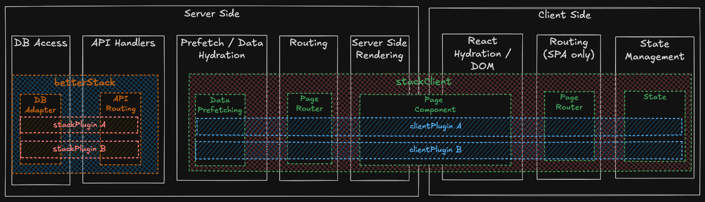

Here's a high-level overview of how BTST works:



## Server Side

The server handles database operations, API endpoints, data prefetching, routing, and server-side rendering.

**`stack`** manages the backend layer:

- **API Router**: Routes incoming requests to the appropriate plugin handlers. Returns a handler function that you mount at your API path.
- **DB Adapter**: Translates BTST's database operations to your ORM (Prisma, Drizzle, Kysely, MongoDB). Plugins define schemas that get merged and passed to the adapter.

**`createStackClient`** manages the rendering layer:

- **Data Fetching**: Plugins can prefetch data server-side into React Query cache before rendering, enabling instant page loads with hydrated state.
- **Page Router**: Matches URLs to plugin routes and returns the appropriate page component, loader, and metadata.
- **SSR**: Server-side renders pages with prefetched data, then hydrates on the client.

## Client Side

After server-side rendering, the client takes over for interactivity.

**React Hydration**

Server-rendered HTML is hydrated with client-side React. The React Query cache—prefetched during SSR—transfers seamlessly, so components render instantly without loading states or refetching.

**SPA Navigation (If using in an SPA)**

After the initial page load, the framework router preset on `StackProvider`
handles client-side navigation. React Query fetches data in the background
while the UI updates.

**State Management**

First party plugins use React Query under the hood for all data operations:

- **Queries**: Hooks like `usePosts()`, `usePost(slug)`, and `useTags()` (examples from the blog plugin) fetch and cache data with automatic background refetching
- **Mutations**: Hooks like `useCreatePost()`, `useUpdatePost()`, and `useDeletePost()` (examples from the blog plugin) handle writes with automatic cache invalidation
- **Suspense**: Suspense variants (`useSuspensePosts`, `useSuspensePost`) integrate with React Suspense boundaries for streaming SSR and other advanced features

Note: 3rd party plugins may use a different state management library.

**Context & Overrides**

The `StackProvider` wraps your pages and exposes framework-wide router, API, and auth services through React Context. Plugin components read router services such as `Link`, `Image`, and `navigate` through `useStack()`, while `usePluginOverrides()` is reserved for genuinely plugin-specific customization.

## Plugins

Plugins are the building blocks of BTST. Each feature (like Blog) ships as **two separate plugins**—one for the backend, one for the client—that you register independently:

```ts
// Backend: lib/stack.ts
import { stack } from "@btst/stack"
import { blogBackendPlugin } from "@btst/stack/plugins/blog/api"

const { handler } = stack({
  plugins: {
    blog: blogBackendPlugin({ /* config */ })
  },
  // ...
})

// Client: lib/stack-client.tsx
import { createStackClient } from "@btst/stack/client"
import { blogClientPlugin } from "@btst/stack/plugins/blog/client"

const stackClient = createStackClient({
  plugins: {
    blog: blogClientPlugin({ /* config */ })
  }
})
```

**Backend plugins** (registered in `stack`):
- Define database schemas (tables, columns, relations)
- Register API route handlers for CRUD operations
- Provide post-authorization domain lifecycle hooks

**Client plugins** (registered in `createStackClient`):
- Define page routes and components
- Provide loaders for server-side data prefetching
- Export components, hooks, and utilities for state management
- Generate SEO metadata and sitemaps

This separation keeps server-only code (database schemas, API handlers) out of your client bundle, and allows each plugin to be configured independently for its context.

## Provider Services and Plugin Overrides

Framework services are configured once on `StackProvider`:

- **`router`**: Use `nextRouter()`, `reactRouter()`, or
  `tanstackRouter()` for links, images, navigation, refresh, and URL search
  state.
- **`api`**: Configure the browser-side API `baseURL` and `basePath`.
- **`auth`**: Resolve identity, provide a login path, and evaluate exact
  schema-backed permission descriptors.

The `overrides` object is only for plugin-specific customization such as
upload functions, component slots, localization, and route analytics. SSR
loader and metadata values remain in each client plugin factory because those
functions run outside React Context.
