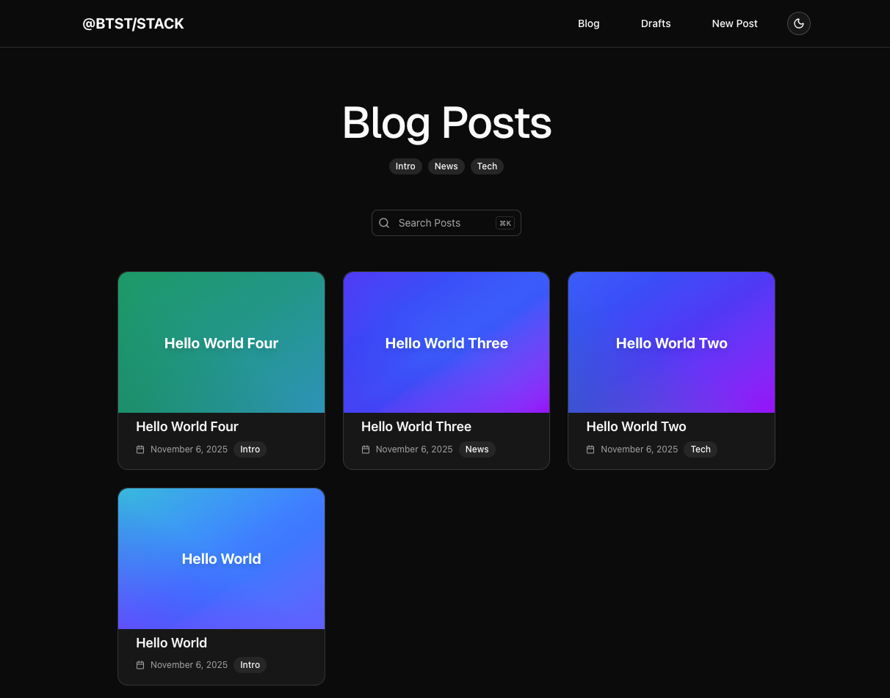

import { Tabs, Tab } from "fumadocs-ui/components/tabs";
import { Callout } from "fumadocs-ui/components/callout";




## Installation

<Callout type="info">
Ensure you followed the general [framework installation guide](/installation) first.
</Callout>

Follow these steps to add the Blog plugin to your Better Stack setup.


### 1. Add Plugin to Backend API

Import and register the blog backend plugin in your `better-stack.ts` file:

```ts title="lib/better-stack.ts"
import { betterStack } from "@btst/stack"
import { blogBackendPlugin } from "@btst/stack/plugins/blog/api"
// ... your adapter imports

const { handler, dbSchema } = betterStack({
  basePath: "/api/data",
  plugins: {
    blog: blogBackendPlugin()
  },
  adapter: (db) => createPrismaAdapter(prisma, db, { 
    provider: "postgresql" 
  })
})

export { handler, dbSchema }
```

The `blogBackendPlugin()` accepts optional hooks for customizing behavior (authorization, logging, etc.).

### 2. Add Plugin to Client

Register the blog client plugin in your `better-stack-client.tsx` file:

```tsx title="lib/better-stack-client.tsx"
import { createStackClient } from "@btst/stack/client"
import { blogClientPlugin } from "@btst/stack/plugins/blog/client"
import { QueryClient } from "@tanstack/react-query"

const getBaseURL = () => 
   (process.env.BASE_URL || "http://localhost:3000")

export const getStackClient = (queryClient: QueryClient) => {
  const baseURL = getBaseURL()
  return createStackClient({
    plugins: {
      blog: blogClientPlugin({
        // Required configuration
        apiBaseURL: baseURL,
        apiBasePath: "/api/data",
        siteBaseURL: baseURL,
        siteBasePath: "/pages",
        queryClient: queryClient,
        // Optional: SEO configuration
        seo: {
          siteName: "My Blog",
          author: "Your Name",
          twitterHandle: "@yourhandle",
          locale: "en_US",
          defaultImage: `${baseURL}/og-image.png`,
        },
      })
    }
  })
}
```

**Required configuration:**
- `apiBaseURL`: Base URL for API calls during SSR data prefetching (use environment variables for flexibility)
- `apiBasePath`: Path where your API is mounted (e.g., `/api/data`)
- `siteBaseURL`: Base URL of your site
- `siteBasePath`: Path where your pages are mounted (e.g., `/pages`)
- `queryClient`: React Query client instance

<Callout type="info">
**Why configure API paths here?** This configuration is used by **server-side loaders** that prefetch data before your pages render. These loaders run outside of React Context, so they need direct configuration. You'll also provide `apiBaseURL` and `apiBasePath` again in the Provider overrides (Section 4) for **client-side components** that run during actual rendering.
</Callout>

### 3. Import Plugin CSS

Add the blog plugin CSS to your global stylesheet:

```css title="app/globals.css"
@import "@btst/stack/plugins/blog/css";
```

This includes all necessary styles for the blog components, markdown rendering, and editor.

### 4. Add Context Overrides

Configure framework-specific overrides in your `BetterStackProvider`:

<Tabs groupId="frameworks" items={["next-js", "react-router", "tanstack"]} persist>
  <Tab value="next-js">
    ```tsx title="app/pages/[[...all]]/layout.tsx"
    import { BetterStackProvider } from "@btst/stack/context"
    import type { BlogPluginOverrides } from "@btst/stack/plugins/blog/client"
    import Link from "next/link"
    import Image from "next/image"
    import { useRouter } from "next/navigation"

    const getBaseURL = () => 
      typeof window !== 'undefined' 
        ? (process.env.NEXT_PUBLIC_BASE_URL || window.location.origin)
        : (process.env.BASE_URL || "http://localhost:3000")

    type PluginOverrides = {
      blog: BlogPluginOverrides
    }

    export default function Layout({ children }) {
      const router = useRouter()
      const baseURL = getBaseURL()
      
      return (
        <BetterStackProvider<PluginOverrides>
          basePath="/pages"
          overrides={{
            blog: {
              apiBaseURL: baseURL,
              apiBasePath: "/api/data",
              navigate: (path) => router.push(path),
              refresh: () => router.refresh(),
              uploadImage: async (file) => {
                // Implement your image upload logic
                // Return the URL of the uploaded image
                return "https://example.com/uploads/image.jpg"
              },
              Link: (props) => <Link {...props} />,
              Image: (props) => <Image {...props} />,
            }
          }}
        >
          {children}
        </BetterStackProvider>
      )
    }
    ```
  </Tab>

  <Tab value="react-router">
    ```tsx title="app/routes/pages/_layout.tsx"
    import { Outlet, Link, useNavigate } from "react-router"
    import { BetterStackProvider } from "@btst/stack/context"
    import type { BlogPluginOverrides } from "@btst/stack/plugins/blog/client"

    const getBaseURL = () => 
      typeof window !== 'undefined' 
        ? (import.meta.env.VITE_BASE_URL || window.location.origin)
        : (process.env.BASE_URL || "http://localhost:5173")

    type PluginOverrides = {
      blog: BlogPluginOverrides
    }

    export default function Layout() {
      const navigate = useNavigate()
      const baseURL = getBaseURL()
      
      return (
        <BetterStackProvider<PluginOverrides>
          basePath="/pages"
          overrides={{
            blog: {
              apiBaseURL: baseURL,
              apiBasePath: "/api/data",
              navigate: (href) => navigate(href),
              uploadImage: async (file) => {
                // Implement your image upload logic
                return "https://example.com/uploads/image.jpg"
              },
              Link: ({ href, children, className, ...props }) => (
                <Link to={href || ""} className={className} {...props}>
                  {children}
                </Link>
              ),
            }
          }}
        >
          <Outlet />
        </BetterStackProvider>
      )
    }
    ```
  </Tab>

  <Tab value="tanstack">
    ```tsx title="src/routes/pages/route.tsx"
    import { BetterStackProvider } from "@btst/stack/context"
    import type { BlogPluginOverrides } from "@btst/stack/plugins/blog/client"
    import { Link, useRouter, Outlet } from "@tanstack/react-router"

    const getBaseURL = () => 
      typeof window !== 'undefined' 
        ? (import.meta.env.VITE_BASE_URL || window.location.origin)
        : (process.env.BASE_URL || "http://localhost:3000")

    type PluginOverrides = {
      blog: BlogPluginOverrides
    }

    function Layout() {
      const router = useRouter()
      const baseURL = getBaseURL()

      return (
        <BetterStackProvider<PluginOverrides>
          basePath="/pages"
          overrides={{
            blog: {
              apiBaseURL: baseURL,
              apiBasePath: "/api/data",
              navigate: (href) => router.navigate({ href }),
              uploadImage: async (file) => {
                // Implement your image upload logic
                return "https://example.com/uploads/image.jpg"
              },
              Link: ({ href, children, className, ...props }) => (
                <Link to={href} className={className} {...props}>
                  {children}
                </Link>
              ),
            }
          }}
        >
          <Outlet />
        </BetterStackProvider>
      )
    }
    ```
  </Tab>
</Tabs>

**Required overrides:**
- `apiBaseURL`: Base URL for API calls (used by client-side components during rendering)
- `apiBasePath`: Path where your API is mounted
- `navigate`: Function for programmatic navigation
- `uploadImage`: Function to upload images and return their URL

**Optional overrides:**
- `Link`: Custom Link component (defaults to `<a>` tag)
- `Image`: Custom Image component (useful for Next.js Image optimization)
- `refresh`: Function to refresh server-side cache (useful for Next.js)
- `localization`: Custom localization strings
- `showAttribution`: Whether to show Better Stack attribution

<Callout type="warn">
**Why provide API paths again?** You already configured these in Section 2, but that configuration is only available to **server-side loaders**. The overrides here provide the same values to **client-side components** (like hooks, forms, and UI) via React Context. These two contexts serve different phases: loaders prefetch data server-side before rendering, while components use data during actual rendering (both SSR and CSR).
</Callout>

### 5. Generate Database Schema

After adding the plugin, generate your database schema using the CLI:

```bash
npx @btst/cli generate --orm prisma --config lib/better-stack.ts  --output prisma/schema.prisma
```

This will create the necessary database tables for posts and tags. Run migrations as needed for your ORM.

For more details on the CLI and all available options, see the [CLI documentation](/cli).

## Congratulations, You're Done! 🎉

Your blog plugin is now fully configured and ready to use! Here's a quick reference of what's available:

### API Endpoints

The blog plugin provides the following API endpoints (mounted at your configured `apiBasePath`):

- **GET** `/posts` - List posts with optional filtering (published status, tag, search query)
- **POST** `/posts` - Create a new post
- **PUT** `/posts/:id` - Update an existing post
- **DELETE** `/posts/:id` - Delete a post
- **GET** `/posts/next-previous` - Get previous and next posts relative to a date
- **GET** `/tags` - List all tags

### Page Routes

The blog plugin automatically creates the following pages (mounted at your configured `siteBasePath`):

- `/blog` - Blog homepage with published posts
- `/blog/drafts` - Draft posts page
- `/blog/new` - Create new post page
- `/blog/:slug` - Individual post page
- `/blog/:slug/edit` - Edit post page
- `/blog/tag/:tagSlug` - Posts filtered by tag

### Adding Authorization

To add authorization rules and customize behavior, you can use the lifecycle hooks defined in the API Reference section below. These hooks allow you to control access to API endpoints, add logging, and customize the plugin's behavior to fit your application's needs.

## API Reference

### Backend (`@btst/stack/plugins/blog/api`)

#### blogBackendPlugin

<AutoTypeTable path="../packages/better-stack/src/plugins/blog/api/plugin.ts" name="blogBackendPlugin" />

#### BlogBackendHooks

Customize backend behavior with optional lifecycle hooks. All hooks are optional and allow you to add authorization, logging, and custom behavior:

<AutoTypeTable path="../packages/better-stack/src/plugins/blog/api/plugin.ts" name="BlogBackendHooks" />

**Example usage:**

```ts title="lib/better-stack.ts"
import { blogBackendPlugin, type BlogBackendHooks } from "@btst/stack/plugins/blog/api"

const blogHooks: BlogBackendHooks = {
  // Authorization hooks - return false to deny access
  onBeforeListPosts(filter, context) {
    if(filter.published === false) {
        return isBlogAdmin(context.headers as Headers)
    }
    return true
  },
  onBeforeCreatePost(data, context) {
    return isBlogAdmin(context.headers as Headers)
  },
  onBeforeUpdatePost(postId, data, context) {
    return isBlogAdmin(context.headers as Headers)
  },
  onBeforeDeletePost(postId, context) {
    return isBlogAdmin(context.headers as Headers)
  },
  // ... other hooks
}

const { handler, dbSchema } = betterStack({
  plugins: {
    blog: blogBackendPlugin(blogHooks)
  },
  // ...
})
```

#### BlogApiContext

<AutoTypeTable path="../packages/better-stack/src/plugins/blog/api/plugin.ts" name="BlogApiContext" />

### Client (`@btst/stack/plugins/blog/client`)

#### blogClientPlugin

<AutoTypeTable path="../packages/better-stack/src/plugins/blog/client/plugin.tsx" name="blogClientPlugin" />

#### BlogClientConfig

The client plugin accepts a configuration object with required fields and optional SEO settings:

<AutoTypeTable path="../packages/better-stack/src/plugins/blog/client/plugin.tsx" name="BlogClientConfig" />

**Example usage:**

```tsx title="lib/better-stack-client.tsx"
blog: blogClientPlugin({
  // Required configuration
  apiBaseURL: baseURL,
  apiBasePath: "/api/data",
  siteBaseURL: baseURL,
  siteBasePath: "/pages",
  queryClient: queryClient,
  // Optional SEO configuration
  seo: {
    siteName: "My Awesome Blog",
    author: "John Doe",
    twitterHandle: "@johndoe",
    locale: "en_US",
    defaultImage: `${baseURL}/og-image.png`,
  },
})
```

#### BlogClientHooks

Customize client-side behavior with lifecycle hooks. These hooks are called during data fetching (both SSR and CSR):

<AutoTypeTable path="../packages/better-stack/src/plugins/blog/client/plugin.tsx" name="BlogClientHooks" />

**Example usage:**

```tsx title="lib/better-stack-client.tsx"
blog: blogClientPlugin({
  // ... rest of the config
  headers: options?.headers,
  hooks: {
    beforeLoadPosts: async (filter, context) => {
      // only allow loading draft posts for admin
      if (!filter.published) {
        return isAdmin(context.headers)
      }
      return true
    },
    afterLoadPost: async (post, slug, context) => {
      // only allow loading draft post for admin
      const isEditRoute = context.path?.includes('/edit');
      if (post?.published === false || isEditRoute) {
        return isAdmin(context.headers)
      }
      return true
    },
    onLoadError(error, context) {
      //handle error during prefetching
      redirect("/auth/sign-in")
    },
    // ... other hooks
  }
})
```

#### RouteContext

<AutoTypeTable path="../packages/better-stack/src/plugins/blog/client/plugin.tsx" name="RouteContext" />

#### LoaderContext

<AutoTypeTable path="../packages/better-stack/src/plugins/blog/client/plugin.tsx" name="LoaderContext" />

#### BlogPluginOverrides

Configure framework-specific overrides and route lifecycle hooks. All lifecycle hooks are optional:

<AutoTypeTable path="../packages/better-stack/src/plugins/blog/client/overrides.ts" name="BlogPluginOverrides" />

**Example usage:**

```tsx
overrides={{
  blog: {
    // Required overrides
    apiBaseURL: baseURL,
    apiBasePath: "/api/data",
    navigate: (path) => router.push(path),
    uploadImage: async (file) => {
      // Implement your image upload logic
      return "https://example.com/uploads/image.jpg"
    },
    // Optional lifecycle hooks
    onBeforePostsPageRendered: (context) => {
      // Check if user can view posts list. This is helpful for SPA. Dont need for SSR as you should check auth in the loader.
      return true
    },
    // ... other hooks
  }
}}
```

## React Data Hooks and Types
You can import the hooks from `"@btst/stack/plugins/blog/client/hooks"` to use in your components.


#### UsePostsOptions

<AutoTypeTable path="../packages/better-stack/src/plugins/blog/client/hooks/blog-hooks.tsx" name="UsePostsOptions" />

#### UsePostsResult

<AutoTypeTable path="../packages/better-stack/src/plugins/blog/client/hooks/blog-hooks.tsx" name="UsePostsResult" />

#### UsePostResult

<AutoTypeTable path="../packages/better-stack/src/plugins/blog/client/hooks/blog-hooks.tsx" name="UsePostResult" />

#### UsePostSearchOptions

<AutoTypeTable path="../packages/better-stack/src/plugins/blog/client/hooks/blog-hooks.tsx" name="UsePostSearchOptions" />

#### UsePostSearchResult

<AutoTypeTable path="../packages/better-stack/src/plugins/blog/client/hooks/blog-hooks.tsx" name="UsePostSearchResult" />

#### UseNextPreviousPostsOptions

<AutoTypeTable path="../packages/better-stack/src/plugins/blog/client/hooks/blog-hooks.tsx" name="UseNextPreviousPostsOptions" />

#### UseNextPreviousPostsResult

<AutoTypeTable path="../packages/better-stack/src/plugins/blog/client/hooks/blog-hooks.tsx" name="UseNextPreviousPostsResult" />

#### UseRecentPostsOptions

<AutoTypeTable path="../packages/better-stack/src/plugins/blog/client/hooks/blog-hooks.tsx" name="UseRecentPostsOptions" />

#### UseRecentPostsResult

<AutoTypeTable path="../packages/better-stack/src/plugins/blog/client/hooks/blog-hooks.tsx" name="UseRecentPostsResult" />

#### PostCreateInput

<AutoTypeTable path="../packages/better-stack/src/plugins/blog/client/hooks/blog-hooks.tsx" name="PostCreateInput" />

#### PostUpdateInput

<AutoTypeTable path="../packages/better-stack/src/plugins/blog/client/hooks/blog-hooks.tsx" name="PostUpdateInput" />
